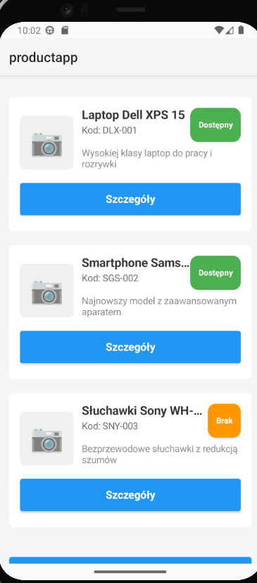
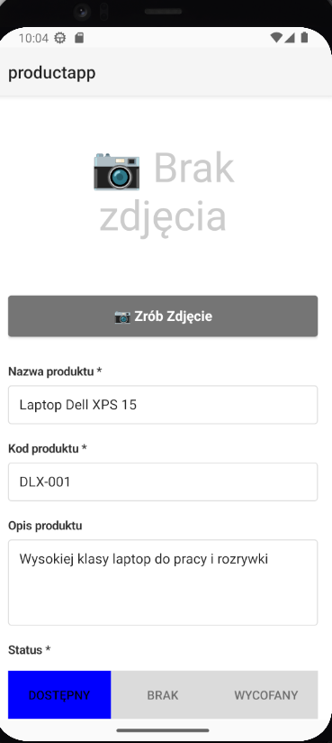

[](https://classroom.github.com/a/Uu9lUx8_)
[](https://classroom.github.com/online_ide?assignment_repo_id=21969359&assignment_repo_type=AssignmentRepo)

# NativeScript: Aplikacja do Zarządzania Produktami

## Cel
Zbudowano podstawową aplikację w **NativeScript używając framework Angular**, która używa **natywnej funkcji** (aparat/kamera) oraz **komunikuje się z API**, z **4 widokami**.

## Zakres i wymagania funkcjonalne

### ✅ Zaimplementowane funkcjonalności:

1. **Natywna funkcja: Aparat/Kamera** 📷
   - Uzasadnienie: Aparat umożliwia skanowanie kodów produktów oraz dodawanie zdjęć produktów bezpośrednio w aplikacji
   - Implementacja: Plugin `@nativescript/camera` z obsługą uprawnień dla Android i iOS
   - Funkcje: Robienie zdjęć, konwersja do base64, podgląd przed zapisem

2. **API Integration** 🌐
   - Endpoint GET: Pobieranie listy produktów
   - Endpoint POST: Dodawanie nowego produktu
   - Endpoint PUT: Aktualizacja produktu
   - Endpoint DELETE: Usuwanie produktu
   - Obsługa błędów i stanów ładowania
   - Tryb mock API dostępny do testowania bez zewnętrznego serwera

3. **Widoki (4):**
   - ✅ **Lista produktów** (`/products`)
     - Wyświetla nazwę, kod i status produktu
     - Kolorowe oznaczenia statusu (Dostępny/Brak/Wycofany)
     - Nawigacja do szczegółów
     - Przycisk dodawania nowego produktu
     - Przycisk do ustawień
   
   - ✅ **Szczegóły produktu** (`/products/:id`)
     - Pełny opis produktu
     - Wyświetlanie zdjęcia (jeśli dostępne)
     - Akcje: Edytuj i Usuń
     - Potwierdzenie przed usunięciem
   
   - ✅ **Dodaj produkt** (`/products/add`)
     - Formularz z walidacją
     - Pola: nazwa*, kod*, opis, status*
     - Integracja z aparatem do robienia zdjęć
     - Walidacja wymaganych pól
     - Obsługa błędów
   
   - ✅ **Ustawienia** (`/settings`)
     - Tryb offline (zapis lokalny)
     - Włączanie/wyłączanie powiadomień
     - Informacje o aplikacji

4. **Walidacja formularza** ✅
   - Wymagane pola: nazwa (min. 3 znaki), kod (min. 2 znaki), status
   - Wyświetlanie komunikatów błędów
   - Wizualne oznaczenie nieprawidłowych pól
   - Blokada wysłania formularza przy błędach

## Struktura projektu

```
product-app/
├── src/
│   ├── app/
│   │   ├── products/
│   │   │   ├── product.ts                    # Model produktu
│   │   │   ├── product.service.ts            # Serwis z komunikacją API
│   │   │   ├── product-list.component.ts     # Lista produktów
│   │   │   ├── product-list.component.html
│   │   │   ├── product-detail.component.ts   # Szczegóły produktu
│   │   │   ├── product-detail.component.html
│   │   │   ├── product-add.component.ts      # Dodawanie produktu
│   │   │   ├── product-add.component.html
│   │   │   ├── product-edit.component.ts     # Edycja produktu
│   │   │   └── product-edit.component.html
│   │   ├── settings/
│   │   │   ├── settings.component.ts         # Ustawienia
│   │   │   └── settings.component.html
│   │   ├── app.component.ts
│   │   ├── app.component.html
│   │   └── app.routes.ts                     # Routing
│   ├── app.css                               # Style CSS
│   └── main.ts                               # Entry point
├── App_Resources/
│   ├── Android/
│   │   └── src/main/
│   │       └── AndroidManifest.xml           # Uprawnienia Android
│   └── iOS/
│       └── Info.plist                         # Uprawnienia iOS
└── package.json
```

## Instalacja i uruchomienie

### Wymagania wstępne:
- Node.js (v18 lub nowszy)
- NativeScript CLI: `npm install -g @nativescript/cli`
- Android Studio (dla Android) lub Xcode (dla iOS)

### Kroki instalacji:

1. **Przejdź do katalogu projektu:**
   ```bash
   cd product-app
   ```

2. **Zainstaluj zależności:**
   ```bash
   npm install
   ```

3. **Uruchom aplikację na Androidzie:**
   ```bash
   ns run android
   ```
   lub na iOS:
   ```bash
   ns run ios
   ```

4. **Uruchom na emulatorze/urządzeniu:**
   - Android: Upewnij się, że emulator jest uruchomiony lub urządzenie jest podłączone przez USB z włączonym debugowaniem USB
   - iOS: Wymagany Mac z Xcode i uruchomionym symulatorem lub podłączonym urządzeniem

## Testowanie

### Testowanie lokalne:

1. **Dodanie produktu z użyciem natywnej funkcji (aparat):**
   - Otwórz aplikację
   - Przejdź do "Dodaj Produkt"
   - Kliknij "📷 Zrób Zdjęcie"
   - Zrób zdjęcie produktu (lub wybierz z galerii)
   - Wypełnij formularz (nazwa, kod, opis, status)
   - Kliknij "Zapisz Produkt"
   - Produkt powinien pojawić się na liście

2. **Komunikacja z API:**
   - Aplikacja domyślnie używa trybu mock API (dane w pamięci)
   - Aby użyć prawdziwego API, zmień `useMockApi = false` w `product.service.ts`
   - Zaktualizuj `apiUrl` na adres Twojego API
   - Testuj pobieranie, dodawanie, edycję i usuwanie produktów

3. **Obsługa błędów:**
   - Wyłącz internet i spróbuj dodać produkt (jeśli używasz prawdziwego API)
   - Spróbuj dodać produkt bez wypełnienia wymaganych pól
   - Sprawdź komunikaty błędów

4. **Uprawnienia:**
   - Przy pierwszym użyciu aparatu, aplikacja poprosi o uprawnienia
   - Na Androidzie: Sprawdź ustawienia aplikacji, jeśli uprawnienia nie zostały przyznane
   - Na iOS: Uprawnienia są zarządzane przez system

## Konfiguracja API

Aplikacja domyślnie używa trybu mock API. Aby użyć prawdziwego API:

1. Otwórz `src/app/products/product.service.ts`
2. Zmień `useMockApi = false`
3. Zaktualizuj `apiUrl` na adres Twojego API:
   ```typescript
   private apiUrl = 'https://twoje-api.com/api/products';
   ```

### Format danych API:

**GET /products** - Zwraca listę produktów:
```json
[
  {
    "id": 1,
    "name": "Nazwa produktu",
    "code": "KOD-001",
    "description": "Opis produktu",
    "status": "available",
    "imageUrl": "base64_string_lub_url"
  }
]
```

**POST /products** - Dodaje nowy produkt:
```json
{
  "name": "Nazwa produktu",
  "code": "KOD-001",
  "description": "Opis produktu",
  "status": "available",
  "imageUrl": "base64_string_lub_url"
}
```

**PUT /products/:id** - Aktualizuje produkt
**DELETE /products/:id** - Usuwa produkt

## Definition of Done (DoD)

- [x] 3–4 widoki + nawigacja ✅
  - Lista produktów
  - Szczegóły produktu
  - Dodaj produkt
  - Ustawienia

- [x] Co najmniej 1 natywna funkcja ✅
  - Aparat/kamera do robienia zdjęć produktów
  - Uprawnienia skonfigurowane dla Android i iOS

- [x] Integracja z API (GET/POST) ✅
  - GET: Pobieranie listy produktów
  - POST: Dodawanie nowego produktu
  - PUT: Aktualizacja produktu
  - DELETE: Usuwanie produktu
  - Obsługa błędów i stanów ładowania

- [x] Walidacja formularza + podstawowa obsługa błędów ✅
  - Walidacja wymaganych pól
  - Minimalna długość pól
  - Wyświetlanie komunikatów błędów
  - Wizualne oznaczenie błędów

- [x] Aktualizacja README.md ✅
  - Instrukcje instalacji
  - Opis funkcjonalności
  - Instrukcje testowania
  - Konfiguracja API

## Zrzuty ekranów

### Lista produktów


### Szczegóły produktu


### Edycja / Dodawanie produktu


### Przykładowe zrzuty do wykonania:
1. Lista produktów
2. Szczegóły produktu
3. Formularz dodawania produktu
4. Aparat w akcji
5. Ustawienia

## Commity

Aplikacja została zbudowana z następującymi głównymi commitami:
1. ✅ Inicjalizacja projektu i konfiguracja
2. ✅ Dodanie modelu i serwisu produktów z komunikacją API
3. ✅ Implementacja widoków: lista, szczegóły, dodawanie, edycja
4. ✅ Integracja aparatu jako natywnej funkcji
5. ✅ Dodanie widoku ustawień i walidacji formularzy
6. ✅ Stylowanie i finalizacja

## Uwagi techniczne

- **Framework:** NativeScript 9.0 z Angular 20
- **Język:** TypeScript
- **Stylowanie:** Tailwind CSS + custom CSS
- **State Management:** Angular Signals
- **Formularze:** Reactive Forms z walidacją
- **Nawigacja:** Angular Router

## Autor

Aplikacja została zbudowana zgodnie z wymaganiami zadania NativeScript.

## Licencja

Projekt edukacyjny.
